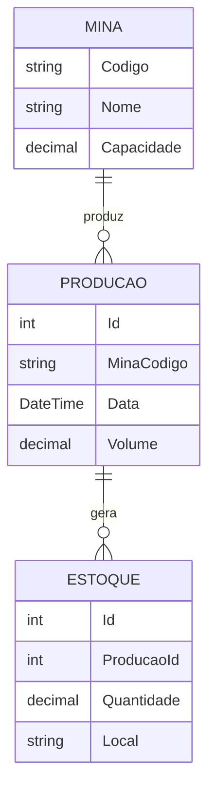

# Case 04 - Sistema de Mina

Sistema de gerenciamento de produção e estoque de minas com autenticação.

## Estrutura

O projeto implementa três entidades relacionadas:



- Uma mina tem várias produções
- Cada produção gera vários estoques

## Arquivos

```
Mina.cs                    - Classe da mina (com controle de acesso)
Producao.cs                - Classe de produção
Estoque.cs                 - Classe de estoque
Credencial.cs              - Credenciais de usuário
SistemaAutenticacao.cs     - Sistema de login
Program.cs                 - Execução principal
```

## Sistema de Autenticação

O acesso aos dados da mina requer login. Sem autenticação, apenas informações básicas são exibidas.

### Credenciais para teste

```
Usuário: admin      Senha: admin123
Usuário: operador   Senha: op123
Usuário: gestor     Senha: gestor123
```

### Como funciona

1. Programa solicita usuário e senha
2. Você tem 3 tentativas para fazer login
3. Senha é mascarada com asteriscos durante digitação
4. Após login com sucesso, acesso é liberado
5. Dados completos das minas são exibidos

## Como testar

```bash
cd dia3/case-04-mina
dotnet run
```

Durante a execução:

- Digite um dos usuários acima
- Digite a senha correspondente
- Pressione Enter

## Validações implementadas

O sistema valida:

- Código e nome não podem ser vazios
- Capacidade e volume devem ser positivos
- Quantidade não pode ser negativa
- Data de produção não pode ser futura
- Aviso quando volume excede capacidade da mina

## Encapsulamento

Todas as classes usam:

- Campos privados com `_prefixo`
- Properties com getters/setters controlados
- Coleções retornam `IReadOnlyList` (somente leitura)
- Métodos `internal` para associações entre entidades

Isso impede acesso direto e modificações não autorizadas nos dados.

## Exemplo de código

```csharp
// Criar sistema de autenticação
SistemaAutenticacao auth = new SistemaAutenticacao();
auth.Autenticar("admin", "admin123");

// Criar mina
Mina mina = new Mina("M001", "Mina Itabira", 1000);

// Liberar acesso (requer autenticação)
mina.LiberarAcesso(auth);

// Criar produção
Producao prod = new Producao(1, DateTime.Now, 800);
mina.AdicionarProducao(prod);

// Criar estoque
Estoque est = new Estoque(1, 500, "Armazém A");
prod.AdicionarEstoque(est);

// Exibir dados (requer acesso liberado)
mina.ExibirResumo();
```

---

**Deloitte Bootcamp - Dia 3**

## Conceitos Demonstrados

- **Senha digitada é mascarada com asteriscos (\*)**
- **Acesso aos dados requer autenticação prévia**
- **Credenciais são exibidas apenas para fins didáticos**

---

**Bootcamp Deloitte - Dia 3**
_Sistema de Gerenciamento de Mina com Encapsulamento Robusto e Autenticação_

- Validação de dados
- Separação de responsabilidades
- Construtores parametrizados

## Observações

- O sistema não persiste dados (apenas em memória)
- As validações lançam `ArgumentException` em caso de dados inválidos
- O encapsulamento impede modificações diretas nas coleções
- Relacionamentos são estabelecidos através de métodos específicos

---

**Bootcamp Deloitte - Dia 3**
_Sistema de Gerenciamento de Mina_
